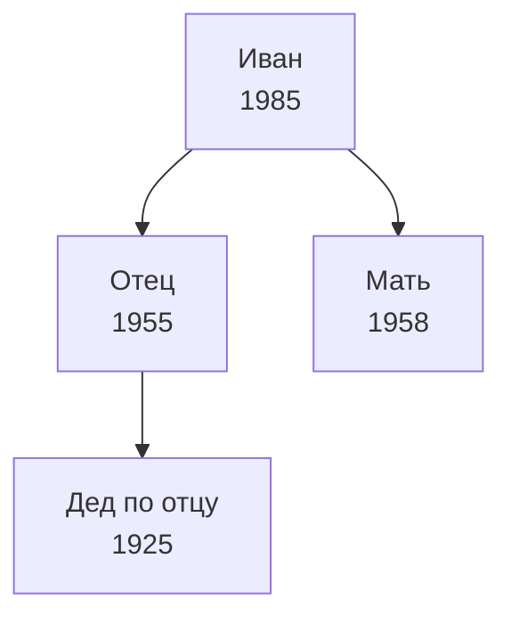

# ⚙️ Настройка Obsidian для генеалогии

## Обязательные плагины (Community Plugins)

### 1. Dataview

**Зачем:** SQL-подобные запросы по frontmatter — основа всех таблиц в Dashboard и шаблонах.

```
Включить: JavaScript Queries = ON
Включить: Inline Queries = ON
Date Format: YYYY-MM-DD
```

### 2. Templater

**Зачем:** Умные шаблоны с авто-подстановкой даты, имени файла и т.д. Лучше стандартного Templates.

```
Template folder: _templates
Trigger on new file creation = ON
```

Пример использования в шаблоне:

```
created: "<% tp.date.now("YYYY-MM-DD") %>"
id: "<% tp.file.title.slice(0,4).toUpperCase() + Math.random().toString(36).slice(2,6) %>"
```

### 3. Obsidian Git

**Зачем:** Автоматический коммит в GitHub прямо из Obsidian.

```
Auto Backup interval: 30 (минут)
Auto backup after stop editing: ON
Commit message: "vault backup: {{date}}"
Pull updates on startup: ON
```

### 4. Kanban

**Зачем:** Доска задач для исследования — "Нужно найти" / "В процессе" / "Найдено".
Создайте файл `Reports/Research Tasks.md` и откройте его как Kanban.

### 5. Calendar

**Зачем:** Навигация по журналу исследований через calendar view.

### 6. Leaflet (опционально)

**Зачем:** Интерактивные карты прямо в заметках. Можно отметить места рождения предков.

````markdown
```leaflet
id: ancestors-map
lat: 55.75
long: 37.61
zoom: 5
marker: "default" | 55.75, 37.61 | [[Places/Москва]]
```
````

````

### 7. Mermaid (встроен в Obsidian)
**Зачем:** Генеалогические схемы прямо в заметках.
Пример:
```markdown


### 8. Iconize (опционально)
**Зачем:** Иконки для папок — визуально удобнее навигировать.

---

## Структура папок

```

genealogy-vault/
├── 📁 People/ — по одному файлу на человека
│ └── Фамилия Имя Отчество.md
├── 📁 Families/ — семейные единицы (муж + жена + дети)
│ └── Фамилия1-Фамилия2.md
├── 📁 Places/ — населённые пункты
├── 📁 Sources/ — документы, архивные дела, книги
├── 📁 Events/ — крупные события (миграция, война и т.д.)
├── 📁 Media/ — сканы, фото (или symlink на внешнюю папку)
├── 📁 Reports/ — аналитика, журнал, итоговые отчёты
├── 📁 \_templates/ — шаблоны (скрыть в файловом менеджере)
├── Dashboard.md — главная страница
└── README.md — для GitHub

```

---

## Соглашения об именовании

| Тип | Формат | Пример |
|-----|--------|--------|
| Человек | `Фамилия Имя Отчество` | `Петров Алексей Николаевич` |
| Человек (неизв. фамилия) | `Имя Отчество (МЕСТО, ГОД)` | `Мария Ивановна (Тула, 1820)` |
| Семья | `ФамилияМужа-ФамилияЖены YYYY` | `Петров-Иванова 1910` |
| Место | Официальное историческое название | `Санкт-Петербург` |
| Источник | `ТИП МЕСТО ГОД описание` | `МК Тула 1875 рождения` |
| ID персоны | P + номер | `P001`, `P042` |

---

## Нумерация поколений (от пробанда)

```

0 = вы
1 = родители
2 = дедушки/бабушки
3 = прадеды
...
-1 = ваши дети

````

---

## Полезные Dataview-запросы

### Все люди определённого поколения
```dataview
TABLE full_name, birth_date, birth_place, father, mother
FROM "People"
WHERE type = "person" AND generation = 3
SORT birth_date ASC
````

### Все люди из конкретного места

```dataview
TABLE full_name, birth_date, generation
FROM "People"
WHERE type = "person" AND (birth_place = [[Places/Тула]] OR death_place = [[Places/Тула]])
```

### Источники без скана

```dataview
TABLE title, source_type, repository
FROM "Sources"
WHERE type = "source" AND (scan = "" OR scan = null)
```

### Люди с неизвестной датой рождения

```dataview
TABLE full_name, generation, father, mother
FROM "People"
WHERE type = "person" AND (birth_date = "" OR birth_date = null)
SORT generation ASC
```

---

## Настройки .obsidian (рекомендуемые)

### appearance

- Theme: Default (или Minimal — хорошо читается)
- Text size: 16px

### editor

- Strict line breaks: OFF (чтобы одинарный перенос работал)
- Auto pair brackets: ON

### files & links

- Default location for new notes: Same folder as current file
- New link format: Relative path
- Detect all file extensions: ON (для медиафайлов)
